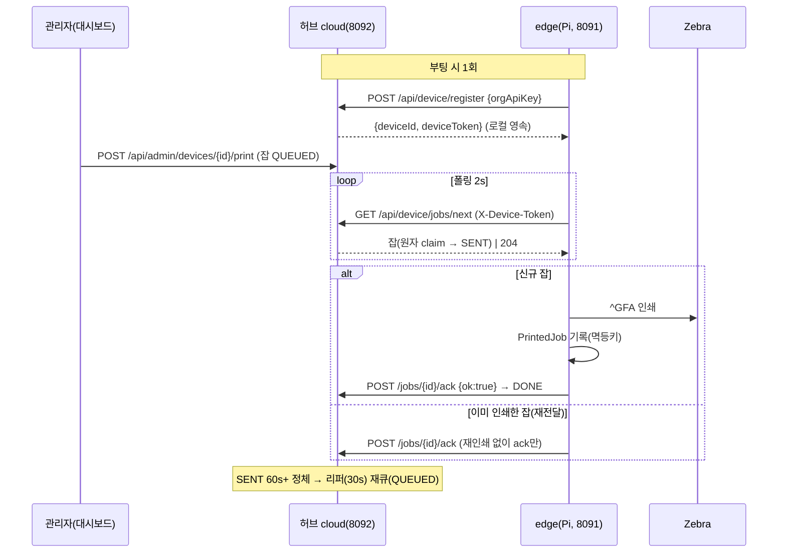
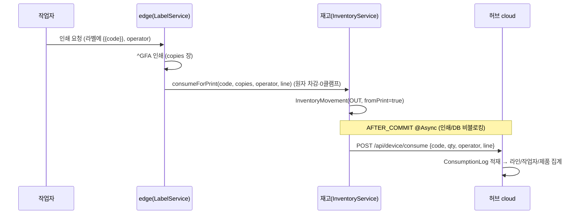
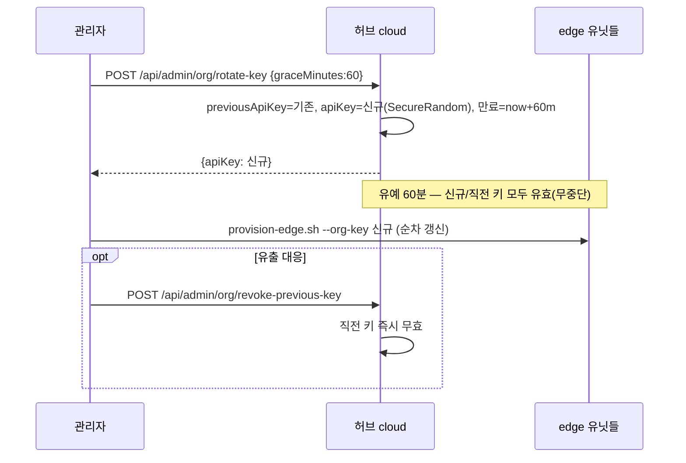

# printscan — 상세 기능 명세서 (SPEC)

> 대상 버전: v2 (edge + cloud 2모듈). 근거: 소스 코드(2026-08-10 기준). 개요는 [`README.md`](README.md).
> 이 문서는 **구현된 것만** 명세한다. 미구현/로드맵은 [`PILOT.md`](PILOT.md)·[`PLAN-V2.md`](PLAN-V2.md) 참조.

## 목차
1. [시스템 아키텍처](#1-시스템-아키텍처)
2. [데이터 모델](#2-데이터-모델)
3. [라벨 요소 스키마](#3-라벨-요소-스키마)
4. [렌더·인쇄 파이프라인](#4-렌더인쇄-파이프라인)
5. [API 레퍼런스 — edge (8091)](#5-api-레퍼런스--edge-8091)
6. [API 레퍼런스 — cloud (8092)](#6-api-레퍼런스--cloud-8092)
7. [클라우드 동기화 프로토콜](#7-클라우드-동기화-프로토콜)
8. [소비 추적](#8-소비-추적)
9. [멀티테넌시 & org-key 로테이션](#9-멀티테넌시--org-key-로테이션)
10. [보안](#10-보안)
11. [국제화(i18n)](#11-국제화-i18n)
12. [관측성·백업·알림](#12-관측성백업알림)
13. [스케줄러 작업](#13-스케줄러-작업)
14. [설정 레퍼런스](#14-설정-레퍼런스)
15. [테스트 커버리지](#15-테스트-커버리지)

---

## 1. 시스템 아키텍처

- **edge (Spring Boot, 8091)**: 라즈베리파이 상주. 로컬 웹 UI(홈/디자이너/스캔) + 라벨 래스터 렌더 + 로컬 인쇄 + 제품/재고 + 허브 동기화 클라이언트. DB=H2 파일.
- **cloud (Spring Boot, 8092)**: 허브. 멀티테넌트 플릿 관리 + 잡 큐 + 소비/재고 집계 + 대시보드. DB=H2(온프렘) 또는 Postgres(SaaS, Flyway).
- **통신 방향**: edge → cloud **아웃바운드 HTTP 폴링만**. cloud는 edge로 직접 접속하지 않는다(방화벽/NAT 친화). 원격 인쇄도 "허브 큐 적재 → edge가 폴링 수령" 방식.
- **패키지 루트**: `com.printscan.edge` / `com.printscan.cloud`.

```
edge 8091                                   cloud 8092
 ├ PageController         (UI)               ├ DashboardController  (UI/로그인)
 ├ LabelApiController     (렌더·인쇄)         ├ DeviceApiController  (디바이스 아웃바운드)
 ├ ScanApiController      (제품·재고)         ├ AdminApiController   (관리/집계/원격인쇄/org-key)
 ├ HealthController       (프린터상태)         ├ LoginController      (세션)
 ├ I18nController         (JS 번들)           ├ I18nController       (JS 번들)
 └ CloudSyncClient  ──폴링/하트비트/소비/템플릿──▶ (device API)
```

---

## 2. 데이터 모델

### 2-1. edge (H2)

**Product** (`product`, unique index `code`)
| 필드 | 타입 | 설명 |
|---|---|---|
| id | Long | PK |
| code | String | 제품 코드(고유, 스캔/자동출고 키) |
| name | String | 제품명 |
| unit | String | 단위(기본 `EA`) |
| quantity | int | 현재 재고 |
| minQty / maxQty | int | 최소/최대 재고(저재고 알림 기준) |
| version | Long | 낙관적 락 필드(동시 입출고 lost-update 방지 보조) |
| createdAt / updatedAt | LocalDateTime | 타임스탬프 |

> 재고 증감은 `ProductRepository`의 **원자적 UPDATE**(`applyDelta`/`clampSubtract`/`setQuantity`)로 수행 → read-modify-write 경쟁 제거.

**InventoryMovement** (`inventory_movement`, index `at`)
| 필드 | 타입 | 설명 |
|---|---|---|
| id | Long | PK |
| productId / code | Long / String | 대상 제품 |
| type | enum `IN`\|`OUT`\|`ADJUST` | 입고/출고/조정 |
| delta | int | 변동량(부호 포함) |
| resultQty | int | 변동 후 재고 |
| note | String | 비고 |
| operator | String | 작업자(소비 귀속) |
| line | String | 생산 라인 |
| fromPrint | Boolean | 인쇄 자동출고 여부 |
| at | LocalDateTime | 시각 |

**LabelTemplate** (`label_template`) — id, name, description, `cloudId`(허브 중앙템플릿 동기화 키), widthMm(기본40), heightMm(기본25), dpi, `elementsJson`(요소 배열 JSON), createdAt/updatedAt.

**DeviceIdentity** (`device_identity`, 단일 행 id=1) — cloudDeviceId, deviceToken. 허브 등록 결과 로컬 영속 → 재시작 후 재등록 방지.

**PrintedJob** (`printed_job`) — jobId(PK). 이미 인쇄한 허브 잡 id 기록 → 재전달 시 **중복 인쇄 방지(멱등키)**.

### 2-2. cloud (H2 / Postgres)

**Organization** (`organization`, unique `apiKey`) — id, name, apiKey, **previousApiKey**, **previousKeyExpiresAt**, **keyRotatedAt**(§9 로테이션).

**Device** (`device`) — id, orgId, name, line, deviceToken(unique), printerMode, lastSeenAt, registeredAt, printCount(누적 인쇄 성공). `online` = lastSeenAt 최근성 파생.

**PrintJobCloud** (`print_job`, index `deviceId,status`) — 원격 인쇄 잡. status enum **`QUEUED`→`SENT`→`DONE`\|`FAILED`**, 라벨 정의(widthMm/heightMm/dpi/elementsJson/variablesJson/copies) + 일련번호(seqVar/serialPrefix/serialStart/serialCount/serialPad) + message + createdAt/sentAt/doneAt. (§7 상태머신)

**ConsumptionLog** (`consumption_log`, index `at`) — orgId, deviceId, line, operator, code, qty, fromPrint, at. 소비(출고) 업싱크 원장.

**InventorySnapshot** (`inventory_snapshot`, unique `deviceId,code`) — 디바이스 재고 스냅샷(하트비트로 업싱크).

**CloudTemplate** (`cloud_template`, index `orgId`) — 조직 중앙 라벨 템플릿(id, orgId, name, widthMm, heightMm, dpi, elementsJson, updatedAt). 디바이스가 폴링으로 로컬 동기화.

---

## 3. 라벨 요소 스키마

라벨은 `elementsJson` = **요소 배열**. 각 요소(`LabelElement`)는 **mm 좌표계**(물리 규격 독립, dpi로 px 변환).

| 필드 | 타입 | 적용 종류 | 설명 |
|---|---|---|---|
| `type` | `TEXT`\|`QR`\|`DATAMATRIX`\|`BARCODE`\|`BOX` | — | 요소 종류 |
| `xMm`,`yMm` | number | 전부 | 좌상단 좌표(mm) |
| `value` | string | TEXT/QR/DATAMATRIX/BARCODE | 내용/데이터. `{{key}}` 변수 치환 |
| `sizeMm` | number | TEXT=글자높이 · QR/DATAMATRIX=한 변 · BARCODE=높이 | 크기(mm) |
| `widthMm` | number | BARCODE=폭 · BOX=폭 | 폭(mm) |
| `heightMm` | number | BOX=높이 | 높이(mm) |
| `bold` | boolean | TEXT | 굵게 |
| `gs1` | boolean | BARCODE | GS1-128(FNC1) |

**요소 종류별 렌더**: TEXT=CJK 폰트, QR/DATAMATRIX/BARCODE(Code128)=ZXing, BOX=채움 사각형/선.

**예시**(60×25mm, 한글 + QR 우측):
```json
[
  {"type":"TEXT","xMm":1.5,"yMm":2,"value":"한글 {{name}}","sizeMm":2.2,"bold":true},
  {"type":"TEXT","xMm":1.5,"yMm":5.5,"value":"{{code}}","sizeMm":2.2},
  {"type":"BARCODE","xMm":1.5,"yMm":9.5,"value":"{{code}}","sizeMm":6.5,"widthMm":18},
  {"type":"QR","xMm":21.5,"yMm":2,"value":"{{code}}","sizeMm":17}
]
```

**변수 치환**: `value` 안의 `{{key}}` 는 요청 `variables` 맵으로 치환. **일련번호 배치**(`SerialSpec`)는 지정 변수(`seqVar`, 기본 `seq`)에 `prefix + (start+i)` 를 `pad` 자리로 채워 `count` 장 연속 출력. 예: `seqVar=seq, prefix=NET-, start=1, count=100, pad=4` → `NET-0001 … NET-0100`.

---

## 4. 렌더·인쇄 파이프라인

```
RenderRequest ──▶ LabelRasterizer(Java2D, mm→px, CJK폰트) ──▶ BufferedImage
                                                                  │
                             미리보기: ImageIO PNG ◀──────────────┤  (= 인쇄물, WYSIWYG)
                                                                  ▼
                       ZplGraphicEncoder(1bpp + ACS 압축) ──▶ ^GFA ZPL ──▶ PrintService ──▶ transport
```

- **RenderRequest**: `{id?, name?, widthMm?, heightMm?, dpi?, elementsJson?, variables?, copies?, operator?}`. `id` 있으면 저장 템플릿 로드, 없으면 인라인 필드로 임시 구성(디자이너 라이브 프리뷰).
- **^GFA**: 흑백 1bpp 래스터 + ACS 런렝스 압축. 미리보기 PNG와 **동일 렌더** → 화면=인쇄물.
- **PrintTransport**(mode로 흡수): `cups`(호스트 CUPS raw 큐, USB 권장) · `network`(IP:9100 raw) · `rawdev`(`/dev/usb/lp0` 직접). `PrintService`가 활성 mode로 dispatch, 미지원 mode는 예외.
- **농도/속도**: `~SD`(darkness 0~30) / `^PR`(speed) — 미설정(-1) 시 프린터 기본.
- **캘리브레이션**: `~JC`(미디어 길이/갭 재측정). **mm 눈금자**: 자 없이 실제 인쇄 가능폭 확인.

---

> **기계가독 API 문서**: 각 모듈은 OpenAPI 3 스펙(`/v3/api-docs`) + Swagger UI(`/swagger-ui.html`) 제공(springdoc). edge는 문서 경로만 인증 면제, cloud는 개방.

## 5. API 레퍼런스 — edge (8091)

> 인증: `/actuator/health`·`/design/**`·`/js/**`·`/favicon.ico`·`/v3/api-docs/**`·`/swagger-ui/**` 외 **전부 HTTP Basic**(기본 `admin`/`printscan`, 배포 시 env 교체). 오류 응답은 요청 로케일로 번역(§11).

### 페이지 (Thymeleaf)
| Method | Path | 설명 |
|---|---|---|
| GET | `/` | 홈(스캔/재고 요약) |
| GET | `/designer` | 라벨 캔버스 디자이너 |
| GET | `/scan` | 스캔 입출고 화면 |

### 라벨 `/api/labels`
| Method | Path | 요청 | 응답 |
|---|---|---|---|
| GET | `/templates` | — | `LabelTemplate[]` |
| GET | `/templates/{id}` | — | `LabelTemplate` (없으면 400 `error.templateNotFound`) |
| POST | `/templates` | `LabelTemplate` | 생성본 |
| PUT | `/templates/{id}` | `LabelTemplate`(patch) | 갱신본 |
| DELETE | `/templates/{id}` | — | 204 |
| POST | `/preview` | `RenderRequest` | **image/png**(미리보기=인쇄물) |
| POST | `/print` | `RenderRequest` | 200 `print.done` / 400 `error.copiesRange`(1~1000) / 500 `print.printerError` |
| POST | `/print-batch` | `BatchRequest`(RenderRequest + seqVar/prefix/start/count/pad) | 200 `print.batchDone` / 400 범위오류 |
| GET | `/ruler?widthMm=&heightMm=&dpi=` | — | image/png(mm 눈금자 미리보기) |
| POST | `/ruler/print?widthMm=&heightMm=&dpi=` | — | 200 `print.rulerDone` |
| POST | `/calibrate` | — | 200 `print.calibrateDone`(~JC 전송) |

### 제품·재고·스캔 `/api`
| Method | Path | 요청 | 응답 |
|---|---|---|---|
| GET | `/products` | — | `Product[]`(최근 갱신순) |
| POST | `/products` | `Product` | 생성본 / 400 `error.productExists` |
| DELETE | `/products/{id}` | — | 204 |
| GET | `/scan/lookup?code=` | — | `Product` / 404 `{found:false}`(미등록→등록 유도) |
| POST | `/inventory/move` | `{code,type(IN\|OUT\|ADJUST),qty,note,operator}` | `InventoryMovement` / 400 `error.stockInsufficient` |
| GET | `/inventory/history?limit=50` | — | `InventoryMovement[]` |

### 프린터·헬스·i18n
| Method | Path | 설명 |
|---|---|---|
| GET | `/api/health` | 간이 상태 |
| GET | `/api/printer/status` | `~HQES` 프린터 상태(용지없음/헤드열림). **network 모드만 지원**, USB/CUPS=`supported:false`(단방향) |
| GET | `/api/i18n/{lang}.json` | JS용 메시지 번들 |

---

## 6. API 레퍼런스 — cloud (8092)

### 6-1. 디바이스 아웃바운드 `/api/device` (edge가 호출; §7)
| Method | Path | 인증 | 설명 |
|---|---|---|---|
| POST | `/register` | org-key(body) | 디바이스 등록 → `{deviceId, deviceToken}`. 잘못된 키 400 `error.badOrgKey`(요청 로케일 번역) |
| GET | `/jobs/next` | `X-Device-Token` | 다음 QUEUED 잡 **원자 클레임(→SENT)**. 없으면 204 |
| POST | `/jobs/{id}/ack` | `X-Device-Token` | `{ok, message}` → DONE/FAILED (SENT 가드·멱등) |
| GET | `/templates` | `X-Device-Token` | 조직 중앙 템플릿(로컬 동기화용) |
| POST | `/heartbeat` | `X-Device-Token` | `{printerMode, line, inventory[]}` → lastSeen 갱신 + 재고 스냅샷 업싱크 |
| POST | `/consume` | `X-Device-Token` | `{code, qty, operator, line, fromPrint}` → 소비 원장 적재 |

### 6-2. 관리 `/api/admin` (테넌트 스코프; §9·§10)
> 인증: 온프렘=세션(로그인) 또는 단일org 폴백 / SaaS=`X-Admin-Token`. 모든 조회·집계·지시는 **호출자 org로 한정**(테넌트 격리). 레이트리밋 대상.

| Method | Path | 설명 |
|---|---|---|
| GET | `/devices` | 조직 장비 목록(online 포함) |
| GET | `/jobs` | 최근 잡 |
| GET | `/snapshots` | 재고 스냅샷 |
| GET | `/stats` | 요약(장비수/온라인/누적인쇄/대기잡) |
| GET | `/consumption` | 라인별/작업자별/제품별 소비 집계 + total |
| GET/POST/DELETE | `/templates`,`/templates/{id}` | 중앙 템플릿 CRUD |
| POST | `/devices/{id}/print` | **원격 인쇄 지시**(대상 장비 org 소유 검증). 입력 상한: copies≤1000, serialCount≤5000, elementsJson≤100KB |
| GET | `/org/key` | 현재 org-key + 로테이션 상태(previousKeyActive/만료/rotatedAt) |
| POST | `/org/rotate-key` | `{graceMinutes}`(기본60, 최대7일) → 신규 키 발급, 직전 키 유예 |
| POST | `/org/revoke-previous-key` | 직전 키 즉시 폐기(유출 대응) |

### 6-3. 세션·i18n
| Method | Path | 설명 |
|---|---|---|
| GET | `/` | 대시보드(미인증 시 `/login` 리다이렉트) |
| GET | `/login` | 로그인 페이지 |
| POST | `/api/login` | `{orgKey}` → 세션 orgId(빈 키=단일org 폴백, 오류 401) |
| POST | `/api/logout` | 세션 무효화 |
| GET | `/api/i18n/{lang}.json` | JS용 메시지 번들 |

---

## 7. 클라우드 동기화 프로토콜

**잡 상태머신**:
```
QUEUED ──(edge GET /jobs/next: 원자 claim)──▶ SENT ──(edge 인쇄 후 POST ack ok=true)──▶ DONE
                                               │                        (ok=false)──▶ FAILED
                                               └──(정체: sentAt < cutoff, 리퍼 30s)──▶ QUEUED (재큐)
```
- **원자 클레임**: `pollNext` 는 `UPDATE ... WHERE status=QUEUED` 로 1건만 SENT 전환 → 중복 전달 방지.
- **멱등**: edge는 인쇄 성공 잡 id를 `PrintedJob`에 기록. 재전달된 잡은 **재인쇄하지 않고 ack만** 재시도.
- **정체 리퍼**: `requeueStale(cutoff)` 가 오래 SENT인 잡을 QUEUED로 되돌림(디바이스 다운 대비). `@Scheduled` 30s/60s.
- **하트비트**(15s): lastSeen 갱신 + 재고 스냅샷 업싱크. **오프라인 감지**(60s): 접속했던 장비 미접속 시 알림.
- **소비 업싱크**: 재고 OUT 이벤트를 `AFTER_COMMIT` @Async 로 허브 `/consume` 전송(인쇄/DB 경로 비블로킹).
- **템플릿 동기화**(30s): 허브 조직 템플릿을 로컬 `LabelTemplate`에 `cloudId` 기준 upsert.
- **타임아웃**: edge RestClient 연결2s/읽기5s(반쯤 열린 TCP가 스케줄러 스레드 블록 방지).

**시퀀스 — 등록 → 원격 인쇄 → ack (아웃바운드 폴링)**


---

## 8. 소비 추적

- **인쇄 = 자동 출고**: `LabelService.print/printBatch` 는 `variables.code` 가 등록 제품이면 인쇄 매수만큼 `consumeForPrint`(원자 차감, 0 클램프 — 인쇄는 막지 않음) → `InventoryMovement(OUT, fromPrint=true, operator, line)`.
- **배치**: 라벨 1장마다 소비 기록 → 중간 실패해도 실제 인쇄분과 일치(드리프트 없음).
- **집계**(허브): `ConsumptionLog` 를 **라인별/작업자별/제품별**로 SQL 집계 → 대시보드.

**시퀀스 — 인쇄 = 자동 출고 → 허브 집계**


---

## 9. 멀티테넌시 & org-key 로테이션

- **테넌트 해석 우선순위**(`OrgContext`): ① 서버 세션(orgId) → ② `X-Org-Key` 헤더 → ③ 단일 org 폴백(온프렘 무중단). 멀티org인데 키 없음 → 400 `error.orgKeyRequired`.
- **키 해석**(`OrgKeyResolver`, 단일 소스): 현재 키 우선, 없으면 **유예기간 내 직전 키** 허용. 로그인·헤더·디바이스 등록 전 경로 통일.
- **로테이션**(`rotateOrgKey(orgId, graceMinutes)`): SecureRandom URL-safe 신규 키 발급, 직전 키를 `graceMinutes`(0=즉시폐기, 최대7일) 동안 유효 유지 → **무중단 교체**. `keyRotatedAt` 감사 기록.
- **즉시 폐기**(`revokePreviousKey`): 유출 시 직전 키 즉시 무효.

**시퀀스 — org-key 무중단 로테이션**


---

## 10. 보안

| 영역 | 온프렘 | SaaS |
|---|---|---|
| edge API | HTTP Basic(`printscan.security.*`) | 동일 |
| cloud 관리 | 세션 로그인 / 단일org 폴백(LAN 신뢰) | **X-Admin-Token**(`AdminAuthFilter`, 상수시간 비교) |
| 전송 | LAN 폐쇄망(TLS 불필요) | **TLS = 리버스 프록시(Caddy/LE)** |
| 테넌트 | org-key 격리 | org-key 격리 + admin-token |
| 남용 방지 | IP 고정창 레이트리밋(`/api/device/register`·`/api/admin/*`), 입력 상한(copies/serial/elements), H2 콘솔 off | 동일 |

> 서버 오류는 원시 한국어 대신 **메시지 코드 → 요청 로케일 번역**(§11)로 노출.

---

## 11. 국제화 (i18n)

- 로케일: **ko(기본)·en·vi·id**. `CookieLocaleResolver` + `?lang=` 변경. `spring.messages`(UTF-8, fallback-to-system-locale=false).
- 범위: UI 라벨(Thymeleaf `th:text`) + **JS 번들**(`/api/i18n/{lang}.json`, `t()`) + **서버 에러/결과 메시지**(`ApiException(code)` → `GlobalExceptionHandler` + `MessageSource` + `LocaleContextHolder`).
- 검증: `I18nCompletenessTest` — 모든 로케일이 기준(ko) 키를 빠짐없이 보유.

---

## 12. 관측성·백업·알림

- **헬스**(`/actuator/health`): 실동작 컴포넌트 `printer`(mode별 실도달성 — cups=서비스 탐색, network=소켓, rawdev=파일존재), `cloud`(허브 최근 접촉), `db`, `diskSpace`. 컴포넌트 DOWN 시 503.
- **메트릭**: `/actuator/prometheus`(micrometer).
- **알림**(`AlertService`, webhook + WARN 로그, 5분 dedup): 저재고 / 프린터 미발견 / 백업 실패 / 디바이스 오프라인. `PRINTSCAN_ALERT_WEBHOOK`(ntfy/Slack 호환) 미설정 시 로그만.
- **백업**: edge H2 매일 03:00, cloud 03:30 `BACKUP TO data/backup/*.zip`(H2만; Postgres는 pg_dump 별도). 복원 `deploy/restore.sh`.

---

## 13. 스케줄러 작업

| 모듈 | 작업 | 주기 | 설명 |
|---|---|---|---|
| edge | `CloudSyncClient.pollJobs` | 2s | 원격 잡 폴링→인쇄→ack |
| edge | `CloudSyncClient.heartbeat` | 15s | 하트비트 + 재고 업싱크 |
| edge | `CloudSyncClient.syncTemplates` | 30s | 중앙 템플릿 동기화 |
| edge | `BackupService.backup` | cron 03:00 | H2 백업 |
| cloud | `FleetService`(리퍼) | 30s | 정체 SENT 잡 재큐 |
| cloud | `FleetService.offlineCheck` | 60s | 오프라인 디바이스 알림 |
| cloud | `BackupService.backup` | cron 03:30 | H2 백업 |

---

## 14. 설정 레퍼런스

> Spring relaxed binding: `printscan.printer.mode` = env `PRINTSCAN_PRINTER_MODE`. edge 설정은 `deploy/edge.env`(또는 `provision-edge.sh`)로 주입.

### edge (`printscan.*`)
| 프로퍼티 | 기본값 | 설명 |
|---|---|---|
| `security.username` / `security.password` | admin / printscan | Basic 인증(⚠️ 배포 시 env 교체) |
| `line.name` | 라인-1 | 이 유닛의 생산 라인(소비 귀속) |
| `printer.mode` | cups | `cups`\|`network`\|`rawdev` |
| `printer.host` / `printer.port` | "" / 9100 | network 모드 대상 |
| `printer.name` | zebra,zd421 | CUPS 큐/프린터 매칭 |
| `printer.device` | /dev/usb/lp0 | rawdev 경로 |
| `printer.darkness` / `printer.speed` | -1 / -1 | `~SD`/`^PR`(-1=프린터 기본) |
| `label.fontFamily` / `label.fontPath` | Noto Sans CJK KR / "" | 한글 폰트(path 우선) |
| `label.defaultDpi` | 203 | 기본 해상도 |
| `cloud.enabled` | false | 허브 동기화 on/off |
| `cloud.baseUrl` | http://localhost:8092 | 허브 주소 |
| `cloud.orgApiKey` | ORG-DEMO-KEY | 조직 키 |
| `cloud.deviceName` | edge-device | 허브 표시 이름 |
| `cloud.pollMs`/`heartbeatMs` | 2000/15000 | 폴링/하트비트 주기 |
| `backup.cron` | 0 0 3 * * * | 백업 스케줄 |
| `alert.webhook` | "" | 알림 webhook URL |

### cloud (`printscan.*`)
| 프로퍼티 | 기본값 | 설명 |
|---|---|---|
| `cloud.bootstrapOrg` / `cloud.bootstrapApiKey` | 기본조직 / ORG-DEMO-KEY | 데모 부트스트랩 조직 |
| `hub.mode` | onprem | `onprem`\|`saas` |
| `hub.adminToken` | "" | 설정 시 `/api/admin/**` 에 `X-Admin-Token` 요구(SaaS) |
| `limits.max-copies` / `limits.max-serial` | 1000 / 5000 | 원격 인쇄 입력 상한 |
| `ratelimit.per-minute` | 120 | IP 고정창 레이트리밋 |
| (prod) `spring.datasource.*` | env DB_URL/USER/PASSWORD | Postgres, `--spring.profiles.active=prod` |
| (prod) `spring.flyway.enabled` / `jpa.ddl-auto` | true / validate | 마이그레이션 + 검증(온프렘 H2는 flyway off) |

---

## 15. 테스트 커버리지

- **edge (28)**: 재고 서비스, 라벨 요소 JSON, 래스터/^GFA 인코더, 보안(Basic·permitAll), i18n 완전성, 에러 로케일화, transport 디스패치, **CloudSyncClient HTTP 계약**(등록 파싱·멱등 재인쇄금지·신규잡 인쇄+기록).
- **cloud (23)**: OrgContext 해석, AdminAuthFilter, FleetService 잡 상태머신(원자 클레임·ack 멱등·교차 org 격리·리퍼), **org-key 로테이션**(유예 공존·유예0 즉시무효·만료 거부·즉시폐기), 레이트리밋, 에러 로케일화, i18n 완전성.
- **Flyway/Postgres**: 실 Postgres16에서 V1(베이스라인)+V2(로테이션 컬럼) 마이그레이션·`validate` 통과 검증.
- **드라이런(.25=Pi 가정)**: install→provision→acceptance `--print` 7/7 PASS + 크래시 자동복구 + 부팅 상주(§[`PILOT.md`](PILOT.md) §8-1).

```bash
./mvnw -f edge/pom.xml test      # edge 28
./mvnw -f cloud/pom.xml test     # cloud 23
```
